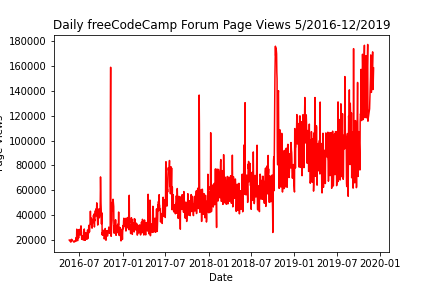
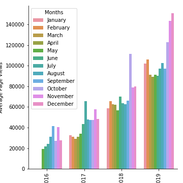
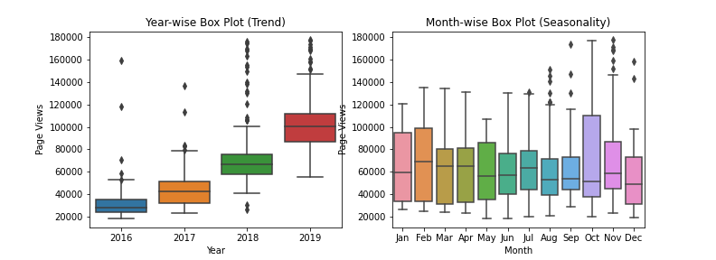

### Data Analysis with Python (freecodecamp)
#### Project 4 - Page View Time Series Visualizer

#### Purpose:

Create three functions in Python to make various plots using matplotlib and seaborn modules that summarize and visualize page view data of freecodecamp.org.

Along with other projects, this one was a step into training for data analysis using Python and gaining a certification from the site.

https://www.freecodecamp.org/certification/joshc714/data-analysis-with-python-v7

#### Plots:

